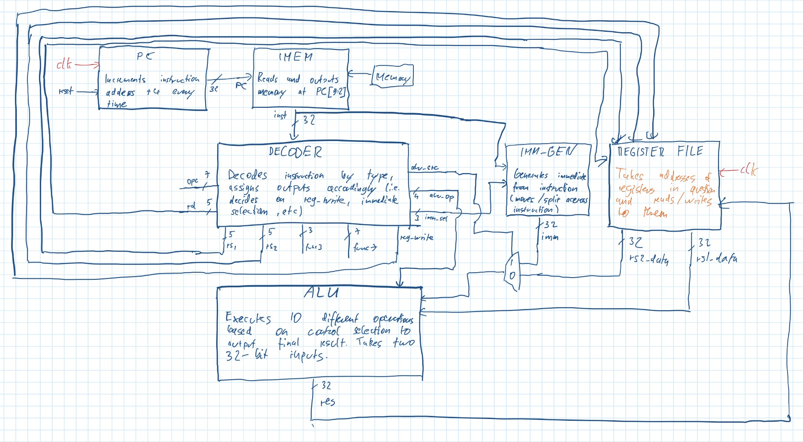
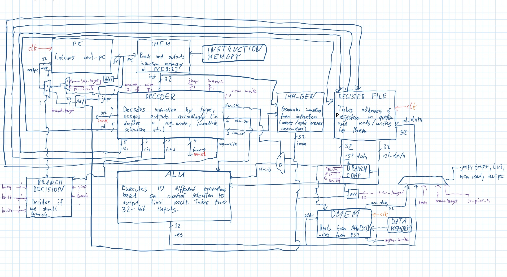
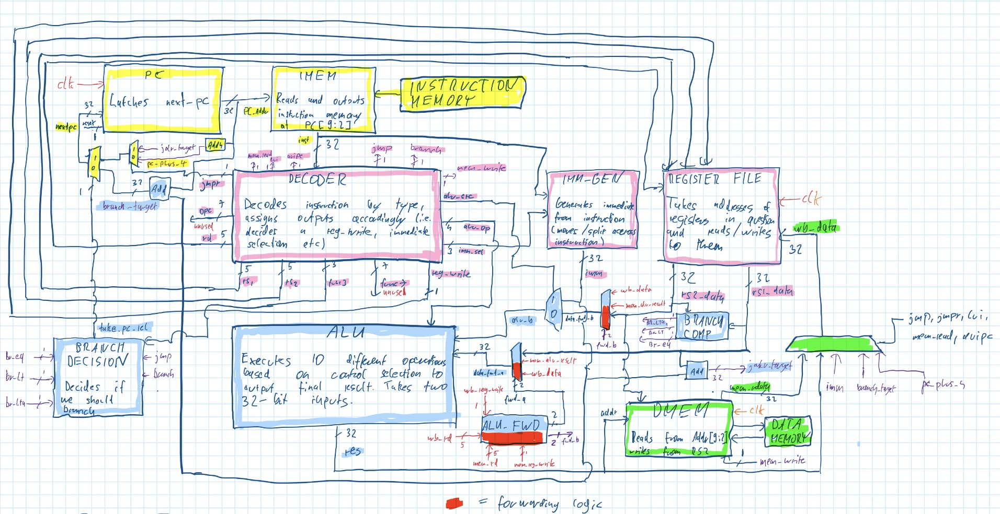
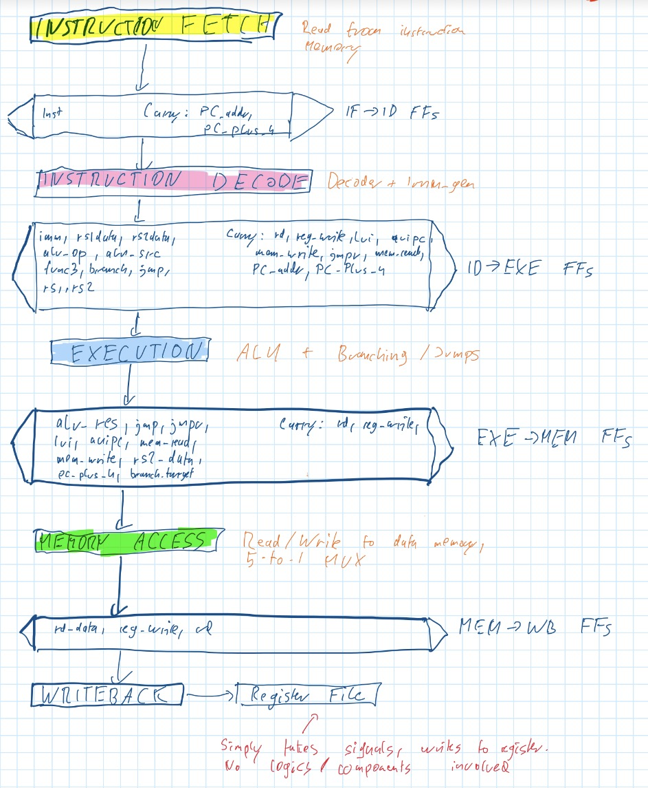

# riscyC1 — A RISC-V RV32I Core on FPGA

A RISC-V RV32I processor written from scratch in SystemVerilog, built module by module
with a self-checking testbench for every component. Target board: **Digilent Arty S7-50**
(Xilinx Spartan-7 XC7S50). Toolchain: **Vivado**.

The repository contains two working cores — a **single-cycle** implementation and a
**5-stage pipelined** version with forwarding and branch flushing — both passing the same
regression suite. The day-by-day reasoning, design decisions, and bugs hit along the way
are recorded in the [build log](docs/devlog.md).

## Status

| Milestone | State |
|---|---|
| Board bring-up (blink) | Done |
| Register file (2R1W, x0 hardwired, write-first) | Done |
| ALU (10 RV32I ops) | Done |
| Immediate generator (I/S/B/U/J) | Done |
| Instruction decoder | Done |
| Single-cycle datapath | Done |
| Conditional branches (all 6) | Done |
| Jumps (JAL / JALR) | Done |
| Data memory (LW / SW) | Done |
| LUI / AUIPC | Done |
| Programs loaded from hex files | Done |
| Self-checking regression suite | Done |
| **5-stage pipeline: stage split + registers** | **Done** |
| **5-stage pipeline: forwarding** | **Done** |
| **5-stage pipeline: branch flushing** | **Done** |
| Synthesis + timing closure (fmax / utilisation) | Next |
| Verification: riscv-tests, Spike co-simulation | Planned |
| UART + on-hardware demo | Planned |
| Byte/halfword loads and stores | Planned |
| Branch prediction + benchmarks (Dhrystone/CoreMark) | Planned |

## Instruction support

Implemented: R-type ALU ops (add, sub, and, or, xor, sll, srl, sra, slt, sltu), I-type
immediate ops, all six conditional branches (beq, bne, blt, bge, bltu, bgeu), JAL/JALR,
LW/SW, LUI/AUIPC.

Not yet implemented: byte and halfword memory access (lb, lbu, lh, lhu, sb, sh), CSRs,
traps/interrupts, the M extension.

## Design

Both cores share the same underlying modules — pipelining changes only how they are wired
together and when signals move between stages.

### Single-cycle datapath

Harvard configuration (separate instruction and data memories, so an instruction fetch and
a data access can occur in the same cycle):

```
pc -> imem -> decoder -> register file -> [operand mux] -> alu -> [writeback mux] -> register file
                      -> imm_gen                                -> dmem
```

Control flow is a 3-way mux on the PC input: `pc+4`, `pc+imm` (taken branches and JAL), or
`rs1+imm` (JALR). Writeback is a 5-way mux: ALU result, memory data, `pc+4` (jumps), the
immediate (LUI), or `pc+imm` (AUIPC). Branch conditions come from a dedicated comparator
rather than the ALU, decoupling the branch decision from ALU computation.

**Initial design sketch:**



**Final single-cycle datapath:**



### 5-stage pipeline

The datapath is split into IF | ID | EX | MEM | WB with four pipeline register banks
between them. Five instructions are in flight simultaneously, so the clock period is set by
the slowest *stage* rather than the slowest *instruction*.

**Pipeline components:**



**Pipeline dataflow:**



#### Hazard handling

**Data hazards — forwarding.** A forwarding unit in EX compares `exe_rs1`/`exe_rs2` against
`mem_rd`/`wb_rd`; two 3-way muxes feed the ALU operands from the register value, the MEM
stage, or the WB stage. MEM takes priority (newer value). The forwarded value is
`mem_wb_data` — the resolved writeback mux output, not the raw ALU result, so `jal`
return addresses and `lui` immediates forward correctly. Store data is forwarded too.

**Control hazards — flushing.** Branches resolve in EX, so two speculatively-fetched
instructions are already in flight when the outcome is known. On a taken branch or jump,
the IF/ID and ID/EX registers are cleared: a zeroed register decodes as opcode 0, hits the
decoder's default case, and becomes a bubble. This reuses the reset path — no new hardware.
EX/MEM and MEM/WB are untouched, since those instructions are older than the branch.

**Register file write-first.** A read in ID of a register being written in WB that same
cycle returns the incoming data rather than the stale stored value.

**Load-use.** No stall is required, because dmem's read is combinational and the writeback
mux resolves in MEM — so the loaded value is already in `mem_wb_data` and forwardable
within the MEM cycle. This is a deliberate tradeoff: it costs a long MEM critical path
(`alu_result → dmem read → writeback mux → forwarding mux → ALU`) and prevents true BRAM
inference. A regression test guards the assumption and will fail if dmem ever becomes a
registered read.

#### Design decisions and known tradeoffs

- **Branches resolve in EX**, not ID — 2-cycle penalty instead of 1, but ID's critical path
  stays short and forwarding is simpler. A measurable optimisation for later.
- **The writeback mux resolves in MEM**, so MEM/WB carries one 32-bit result rather than
  five values plus five selects (~165 fewer flip-flops, and WB becomes trivially short).
  Moving it to WB would shorten the MEM path — WB has enormous slack.
- **The ALU operand mux resolves in EX**, carrying `rs2_data` / `imm` / `alu_src`
  separately, because forwarding must inject values immediately before the ALU and replaces
  the *register* operand, not the immediate.

## Repository layout

```
rtl/
  pc.sv               Program counter
  imem.sv             Instruction memory (loads a hex program)
  dmem.sv             Data memory
  decoder.sv          Instruction decoder + control signal generation
  register_file.sv    32x32 register file (2 read, 1 write; x0 hardwired; write-first)
  imm_gen.sv          Immediate generator (I/S/B/U/J formats)
  alu.sv              ALU (10 RV32I operations)
  core.sv             Single-cycle top-level datapath
  core_pipelined.sv   5-stage pipelined top-level datapath
  blink.sv            Board bring-up test
tb/                   Self-checking testbench per module, plus core regression suites
programs/             Test programs as hex files
constraints/          Minimal per-project XDC for the Arty S7-50
boards/               Pristine Digilent master XDC (reference only)
scripts/              build.tcl - regenerates the Vivado project from source
docs/                 Build log and diagrams
```

## Verification

Every module has a self-checking testbench that reports PASS/FAIL and targets edge cases
(sign-extension, funct7 decode, signed vs unsigned comparison, x0 handling).

The core **regression suite** loads each program in `programs/`, runs it, and asserts on
the resulting register and memory state. `tb/core_tb.sv` runs it against the single-cycle
core; `tb/core_pipe_tb.sv` against the pipelined one — which is how hazard handling was
tracked as it was added (11/16 → 15/16 → 16/16 → 18/18).

Coverage: ALU ops, store/load round trip, branch taken and not-taken, function call and
return, LUI/AUIPC, and a load-use hazard guard.

**Current results: single-cycle 16/16, pipelined 18/18.**

## Building

Source-only — Vivado's generated files are not committed. Regenerate the project:

1. In Vivado's Tcl console:
   ```
   cd <path-to-repo>
   source scripts/build.tcl
   ```
2. Run synthesis, implementation, and generate bitstream — or run a testbench via
   Run Simulation (set the desired `*_tb` as simulation top).

### Known limitation: hex file paths

The `$readmemh` calls in `rtl/imem.sv` and the core testbenches currently use **absolute
paths** to `programs/*.hex`, so they must be edited to match your checkout location.

Relative paths resolve against the simulator's working directory
(`build/*.sim/sim_1/behav/xsim/`), which lives inside the gitignored build folder. The
proper fix is to add the hex files to the Vivado project as simulation data files so a bare
filename resolves.

## License

MIT — see [LICENSE](LICENSE).
